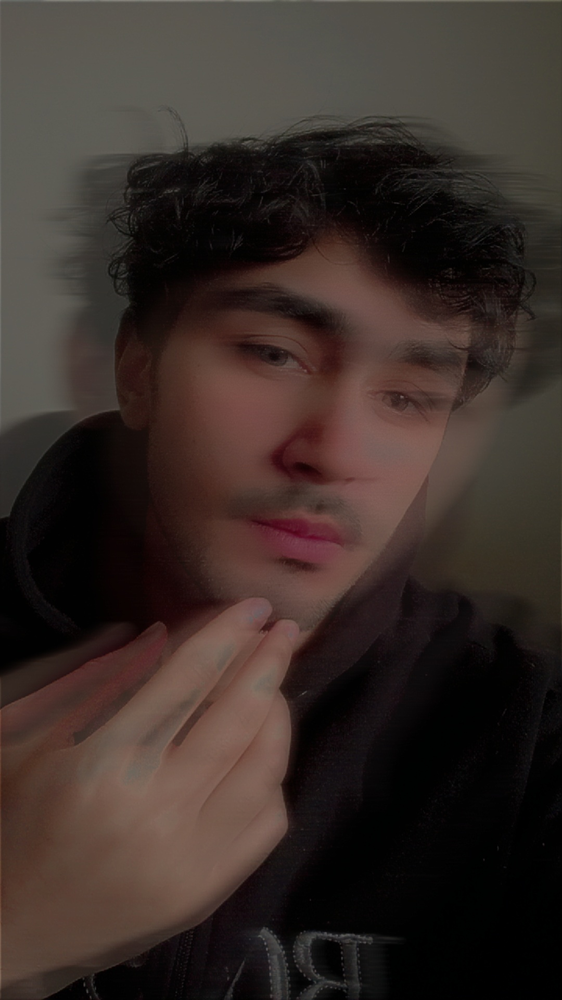

<html lang="en">
<head>
    <meta charset="UTF-8">
    <meta name="viewport" content="width=device-width, initial-scale=1.0">
    <title>Muhammad Nazim | Official Portfolio</title>
    <link rel="stylesheet" href="https://cdnjs.cloudflare.com/ajax/libs/font-awesome/6.0.0/css/all.min.css">
    <link href="https://fonts.googleapis.com/css2?family=Outfit:wght@300;400;600;800&display=swap" rel="stylesheet">
    
</head>
<body>

    

        

            

                
            

            <h1>Muhammad Nazim</h1>
            
Digital Creator | Web Explorer

            
            

                <a href="https://www.facebook.com/profile.php?id=100084218946114" target="_blank" class="social-icon" title="Facebook"><i class="fab fa-facebook-f"></i></a>
                <a href="https://www.instagram.com/mr_nazim073?igsh=MXd4d2hmcWNvNjVsdQ==" target="_blank" class="social-icon" title="Instagram"><i class="fab fa-instagram"></i></a>
                <a href="https://www.linkedin.com/in/muhammad-nazim-7401b6310" target="_blank" class="social-icon" title="LinkedIn"><i class="fab fa-linkedin-in"></i></a>
                <a href="https://wa.me/923000000000" target="_blank" class="social-icon" title="WhatsApp"><i class="fab fa-whatsapp"></i></a>
            

        

        

            

                <h2 style="color: var(--primary); margin-bottom: 15px;"><i class="fas fa-user"></i> About Me</h2>
                

                    Main Muhammad Nazim hoon. Mujhe nayi technology explore karne aur modern digital designs banane ka junoon hai. Ye website meri GitHub journey ka pehla qadam hai.
                

            

            

                <h2 style="color: var(--accent); margin-bottom: 15px;"><i class="fas fa-paper-plane"></i> Quick Contact</h2>
                
Mujhse rabta karne ke liye click karein:

                <button type="button" class="submit-btn" onclick="window.location.href='mailto:your-email@example.com'">Say Hello</button>
            

        

        <footer>
            © 2026 | MUHAMMAD NAZIM | DESIGNED WITH AI
        </footer>
    

</body>
</html>
